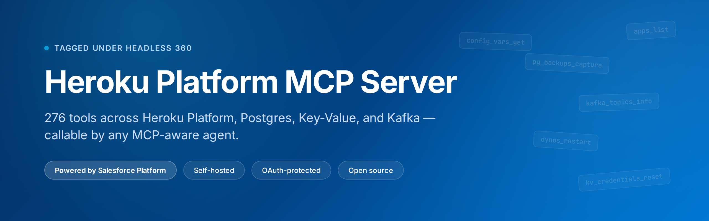

<p align="center">
  
</p>

<p align="center">
  <a href="https://www.npmjs.com/package/@heroku-mcp/http-server"></a>
  <a href="https://github.com/StratisLLC/heroku-platform-mcp-server/releases"></a>
  <a href="https://github.com/StratisLLC/heroku-platform-mcp-server/blob/main/LICENSE"></a>
  <a href="https://github.com/StratisLLC/heroku-platform-mcp-server/actions"></a>
</p>

<p align="center">
  <strong>An MCP server that exposes the Heroku platform as agent-callable tools.</strong><br>
  Self-hosted, OAuth-protected, open source.
</p>

<p align="center">
  <a href="https://stratisllc.github.io/heroku-platform-mcp-server/">📖 Quickstart guide</a> ·
  <a href="#deploy-your-own">🚀 Deploy your own</a> ·
  <a href="#documentation">📚 Documentation</a> ·
  <a href="https://github.com/StratisLLC/heroku-platform-mcp-server/releases">📦 Releases</a>
</p>

---

## What this is

A Model Context Protocol (MCP) server that gives Claude and other AI assistants access to the **Heroku platform** — apps, dynos, builds, releases, Postgres databases, Key-Value stores, Kafka clusters, and more. **276 tools** total, callable by any spec-compliant MCP client.

Each user authenticates with their own Heroku account; tools act on their behalf using their own permissions.

**Tool coverage:**

| Category | Tools | Notes |
|---|---|---|
| **Heroku Platform API** | Apps, dynos, builds, releases, config vars, addons, teams, spaces, webhooks, OAuth clients | Read + write |
| **Heroku Postgres** | Info, credentials, backups, followers, maintenance | Read + write with confirm guards |
| **Key-Value Store (Redis)** | Admin, credentials, config, stats | Read + write |
| **Apache Kafka on Heroku** | Cluster info, topics, consumer groups | Read |

## Two endpoints

Both expose the same 276 tools. Pick based on your context budget.

| Endpoint | Behavior | Best for |
|---|---|---|
| `/mcp` | Returns full catalog of 276 tool schemas at session start (~60,812 tokens) | Clients that pre-load all tools |
| `/mcp-codemode` | Returns 3 meta-tools (`search`, `execute`, `auth_status`). Agent discovers tools on-demand. **87% reduction end-to-end.** | Multi-conversation usage, token-conscious deployments |

Functionally identical. Same auth, audit, confirm guards, and tools. See [docs/CODE-MODE.md](docs/CODE-MODE.md).

## Deploy your own

Before clicking the button, provision a Heroku OAuth client (the deploy form needs it). Full walkthrough: [docs/OAUTH-SETUP.md](docs/OAUTH-SETUP.md).

[](https://heroku.com/deploy?template=https://github.com/StratisLLC/heroku-platform-mcp/tree/main)

Takes about five minutes. After deploy, your server runs at `https://YOUR-APP.herokuapp.com`.

## Connect from Claude Desktop

1. **Settings → Connectors → Add custom connector**
2. **URL:** `https://YOUR-APP.herokuapp.com/mcp` (or `/mcp-codemode` for token-optimized)
3. Leave OAuth fields blank — Dynamic Client Registration handles it
4. Click **Add**, complete the Heroku OAuth flow in the browser
5. Connector shows as Connected with 276 tools available

For other MCP clients (Cursor, claude.ai web, custom integrations), the URL is the same. Configuration syntax varies; see the [quickstart guide](https://stratisllc.github.io/heroku-platform-mcp-server/) for client-specific details.

## Packages

Published to npm under the [`@heroku-mcp`](https://www.npmjs.com/org/heroku-mcp) scope:

| Package | Description | Version |
|---|---|---|
| [`@heroku-mcp/http-server`](https://www.npmjs.com/package/@heroku-mcp/http-server) | The deployable HTTP + MCP server |  |
| [`@heroku-mcp/core`](https://www.npmjs.com/package/@heroku-mcp/core) | Shared helpers (auth, audit, capabilities, envelopes) |  |
| [`@heroku-mcp/platform`](https://www.npmjs.com/package/@heroku-mcp/platform) | Heroku Platform API tools |  |
| [`@heroku-mcp/postgres`](https://www.npmjs.com/package/@heroku-mcp/postgres) | Heroku Postgres tools |  |
| [`@heroku-mcp/key-value`](https://www.npmjs.com/package/@heroku-mcp/key-value) | Heroku Key-Value (Redis) tools |  |
| [`@heroku-mcp/kafka`](https://www.npmjs.com/package/@heroku-mcp/kafka) | Apache Kafka on Heroku tools |  |
| [`@heroku-mcp/admin-cli`](https://www.npmjs.com/package/@heroku-mcp/admin-cli) | Server admin CLI |  |

All packages are published with [sigstore provenance attestations](https://docs.npmjs.com/generating-provenance-statements).

## Architecture

- **Pure HTTPS client** — no Heroku CLI shellout, no bundled binaries, no protocol libraries
- **Multi-user OAuth** — per-user Heroku tokens encrypted at rest, Dynamic Client Registration for MCP clients
- **Lazy public URL resolution** — server learns its hostname from the first inbound request, no Heroku Labs dyno metadata required
- **Layered tool gating** — capability probes at registration, confirm guards for destructive ops, audit logging on every invocation

## Documentation

| Doc | Purpose |
|---|---|
| [📖 Quickstart guide](https://stratisllc.github.io/heroku-platform-mcp-server/) | Polished overview, connect from any client |
| [docs/OAUTH-SETUP.md](docs/OAUTH-SETUP.md) | Heroku OAuth client provisioning before deploy |
| [docs/CODE-MODE.md](docs/CODE-MODE.md) | Token-optimized `/mcp-codemode` endpoint details |
| [packages/http-server/README.md](packages/http-server/README.md) | HTTP server package internals |
| [TRADEMARKS.md](TRADEMARKS.md) | Salesforce / Heroku trademark attribution |

## Development

```bash
pnpm install
pnpm -r build
pnpm -r test
```

Workspace uses pnpm 9.15.9 and Node 24. See individual package READMEs for details.

## Contributing

Issues and PRs welcome. For substantial changes, open an issue first to discuss the approach.

---

<sub>Published by <strong>Stratis, LLC</strong>. Licensed under Apache-2.0.</sub>

<sub>Salesforce and the Salesforce logo are trademarks of Salesforce, Inc. Heroku and the Heroku logo are trademarks of Salesforce, Inc. This is an independent open-source project and is not affiliated with, endorsed by, or sponsored by Salesforce.</sub>
